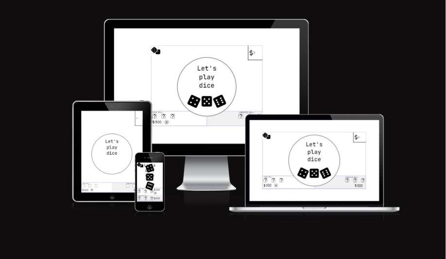
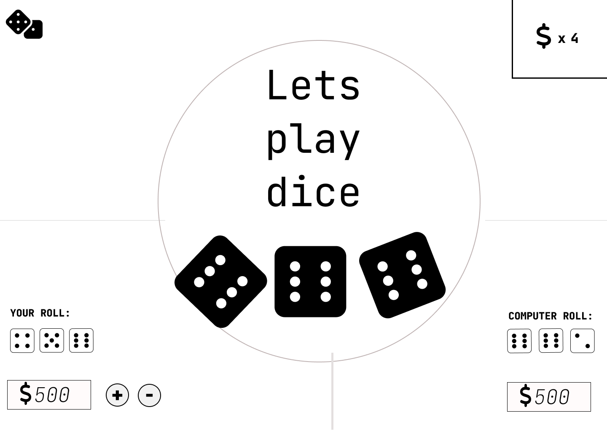
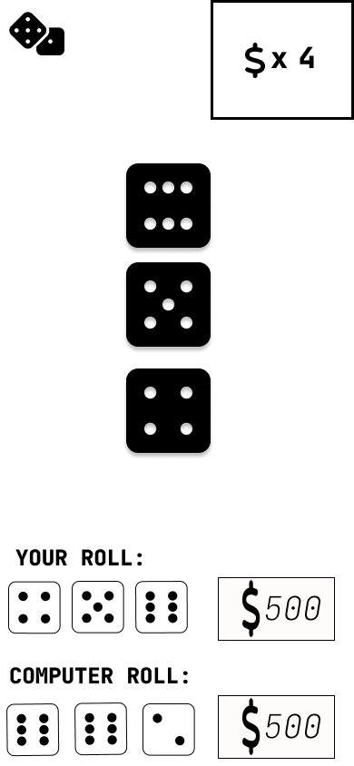
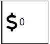
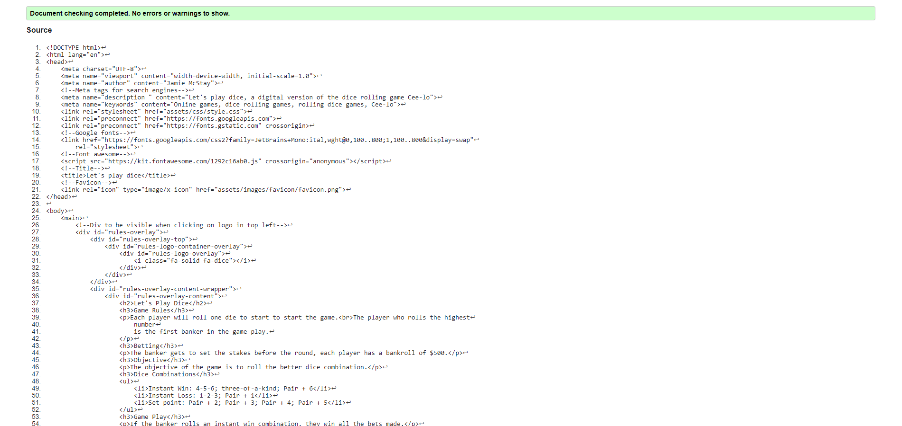

# Let's Play Dice

## **[Live Site](https://jamiemcstay.github.io/Let-s-play-dice/)**
## **[Repository](https://github.com/jamiemcstay/Let-s-play-dice)**

## A dice rolling game

>Let's play dice is a digital version of the dice rolling game known commonly as Cee-lo. Cee-lo can be played with 2 or more players who bet on rounds to roll the better dice combinations.

### Setup

>Each player rolls a single dice, the player who rolls the highest number is the banker, who gets to set the stakes for the first round. Each player has a bankroll of $500. 
 

### Dice combinations

> Instant Win: 4-5-6, three-of-a-kind, Pair+6

> Instant Loss: 1-2-3, Pair + 1

> Set point: Pair + 2, Pair + 3, Pair + 4 Pair + 5

### Gameplay 

> The Banker is the first to roll three dice, with the aim to roll a winning combination or a pair and set point. 

> If the banker rolls a instant win combination, they win all the bets made.

> If the banker rolls an instant loss combination, they lose all the bets made.

> If the banker rolls a set point, the other player gets a turn to roll three dice. If the player get an instant win combination or higher point they win all the bets.

> The winner of the round is the banker in the next round and gets to set the stakes. 

> Gameplay continues until either players bankroll is at $0. 

## Contents 

1. [UX](#ux)
2. [Features](#features)
3. [Features left to impement](#left)
4. [Technology used](#technology)
5. [Testing](#testing) 
6. [Bugs](#bugs)
7. [Deployment](#deployment)
8. [Credits](#credits)
9. [Content](#content)
10.[Acknowledgements](#acknowledgements)

## UX 

### Project research

> For project two I wanted to pick something a little bit different. After some consideration I settled on Cee-lo, as it is a game I used to play with friends a lot and it is a lot of fun, and I thought it would be a good challenge.

### UX Design

#### Color

As Cee-lo is a simple game, so I wanted to keep the design minimal, and when designing in figma I really liked the simplicity of the black, white and grey colors, so I decided to keep these. 

#### Font 

For the font I chose jetBrains mono, as its clear with distinct characters and is sufficient in updating the user as to gameflow information.

#### Icons

I used font awesome dice for the dice in my design as looked really nice. 

#### Structure 

I built this program desktop first, and used google developer tools to modify my approach to styling on smaller screens. 

## User Stories

> As a user I want a fun game to play.
> As a user I want a gambling game.
> As a user I want to be able to understand whats happening as the game progresses.
> As a user I want to be able to see my assets, in the form of my score and my bank roll. 
> As a user I want to be able to continue to play the game until I close down the page. 

## Wireframes

### Desktop and mobile wireframes

I used figma to design this project, the wireframes for desktop and mobile can be seen below.

#### Desktop

#### Mobile

## Features

### index.html

#### Rules overlay 

Cee-lo is a popular game, however there are multiple ways to play, and some people have never played before, so I wanted add a feature whereby the user would be prompted to read the rules first. I did this by adding dice icons in the top left corner, that pulse when the screen first loads. When the user clicks this dice icon, they are presented with rules and information on gameplay. When they click out of this, the pulsing is removed fron the icon.

I created the pulsing effect by using keyframes in css. Then using two functions in javascript, I add and remove the pulsing effect accordingly.

#### Interactive Zone

This is the space where all information regarding gameflow takes place: 

- Prompts the user to click to roll one or three dice. 
- Prompts the user to set the stakes when they are the banker. 
- Updates the user when they are rolling.
- Updates the user when computer is rolling.
- Updates the user what their roll result was.
- Updates the user what the computers roll was.
- Updates the user who won the round. 
- Updates the user on the amount of stakes won or lost.
- Updates the user when the game is over, if they won or lost, and prompts the user to play again if they wish to do so.

#### Score Area

This is the space where both the users and the computers score, and bank roll are displayed.

After either player has rolled a set point it allows them to view their Pair + point in preperation for the next player to roll, and to understand if they are to win or lose the round.

When the user is the banker in any given round, they can click on the update stakes button to increase the stakes of a round  and view the current balance of their bank roll throughout the game.

#### Piggy Bank

This is the area where the user can view the stakes for the current round.

## Features left to implement

> In the future I would like to imlement a feature to be able to play against friends instead of the computer. 

>  A feature that tells the user what their tells the user what they need to roll to win the round. 

> A feature to view what the last rounds rolls have been.

## Technology used

### Languages

- HTML
- CSS
- Javasript

### Tools 

- Figma
- Gitpod
- Github
- Font Awesome
- W3C HTML Validation
- W3C CSS Validation
- JSHint Validation
- Google Lighthouse
- Am I responsive
- Favicon.io

## Testing 

### Code Validation 

W3C reported no errors the HTML.

W3C reported no errors for the css file.

JSHint reporting no errors, and only warnings for using template literal syntax only available in ES6

### Lighthouse

The lighthouse test for mobile passed.

The lighthouse text for desktop passed.

### Responsiveness

I used google chrome developer tools to check the responsiveness of the game on all differenet screen sizes, and used css to modify it to fit all screen sizes.

### Features testing

In order to test the features of the game I had my two housemates and two family members play the game and answer thee questions with  either a pass or a fail: 

>Question 1
Does the game interactivity work how it should?
- Interactive zone allows the user to click when they are prompted.
- Does the UI correctly update with results and gameflow information.

>Question 2
Does the game correctly analyse the results of the rolls and award the winner as specified in the rules of the game?

>Question 3
Does the game correctly update the piggy bank and correctly update the user and computers bankrolls according to the winner of the round?

>Question 4
Does the game allow the user to click to restart the game once they have played through until game over?

>The results of these tests are below: 

| Tester 1 | Result|
|:------:|------:|
| Q1     | PASS  |
| Q2     | PASS  |
| Q3     | PASS  |
| Q4     | PASS  |  

| Tester 2 | Result|
|:------:|------:|
| Q1     | PASS  |
| Q2     | PASS  |
| Q3     | PASS  |
| Q4     | PASS  |  

| Tester 3 | Result|
|:------:|------:|
| Q1     | PASS  |
| Q2     | PASS  |
| Q3     | PASS  |
| Q4     | PASS  |  

| Tester 4 | Result|
|:------:|------:|
| Q1     | PASS  |
| Q2     | PASS  |
| Q3     | PASS  |
| Q4     | PASS  |  

### My testing

I also went through the game multiple times and tested its functionality. 

#### Interactive Zone

| Tester | Result|
|:------:|------:|
| Clickable at correct time     | PASS  |
| Updates gamelow information correctly     | PASS  |
| Updates on roll results correctly    | PASS  |
| Updates stakes information     | PASS  |
| Updates on round winner correctly     | PASS  |
| Updates on game winner correctly     | PASS  |  

#### Score Area

| Tester | Result|
|:------:|------:|
| Correctly updates score information     | PASS  |
| Correctly removes score information after each round     | PASS  |

#### Piggy Bank

| Tester | Result|
|:------:|------:|
| Removes stakes from each player when stakes set    | PASS  |
| Removes stakes and updates in winers bank roll at round end | PASS |

#### Rules overlay 

| Tester | Result|
|:------:|------:|
| Opens when clicking on dice in left corner     | PASS  |
| Closes when clicking on dice     | PASS  |

## Bugs

- Issue with the handling of data solved by converting data into strings to be handled with consistent methods across the program: FIXED
- Issue with glitch in handling roll results solved by using replace method to remove spaces in strings and correctly convert string values to an integers to be used to compare roll results between players: FIXED
Issues with timing solved by modifying timeouts to allow games pace to flow correctly: FIXED 

## Deployment

I used github to deploy this project and followed these steps from the main repository. 

1. Clicked on the settings tab.
2. Select the pages menu.
3. Choose main from the source dropdown menu.
4. Leave dropdown menu /root as default option. 
5. Click Save. 

> I then waited for 5 minutes before refreshing the page and my site had gone live. 

## Credits

I used the following sources as tools to help me with the development of this project.

### W3 Schools 

> Used for looking up information on JS, CSS and HTML. 

### Code Institute Content

> Used for looking up information on JS, CSS and HTML. 

### Youtube.com

> Used to research different concepts in javscript such as:

https://www.youtube.com/watch?v=T76E09hnEuo

https://www.youtube.com/watch?v=YHx54TFgJ8k&list=PLt4757glfbhGVMrh0fe33vZppbb700Spc

### Font Awesome

> Used for icons and favicons. 

MDN Docs

> Used for information on javascipt, css and html. 

#### Acknowledgements

My mentor Alan Bushell who provided me with construcive feedback throughout the development of this project. 

